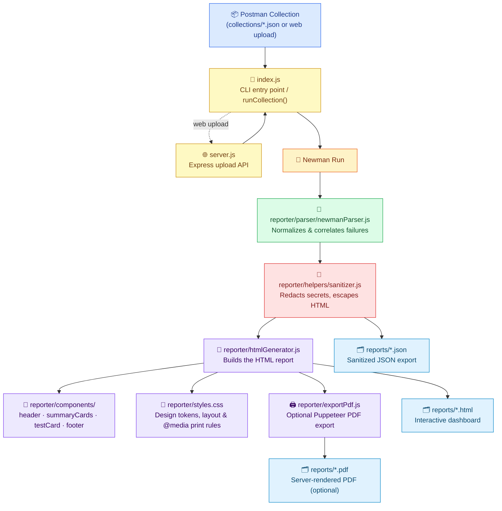

<div align="center">

# 🚀 TestVista

### A modular, security-conscious HTML reporter for Postman/Newman collections

<em>Turns raw API test runs into a polished, printable dashboard — with sensitive data redacted before it ever touches disk.</em>

<br>


<br>


</div>

<br>

---

## 🎯 Overview

**TestVista** wraps [Newman](https://github.com/postmanlabs/newman) — Postman's collection runner — in a clean, component-based reporting layer. Run a collection once and get back:

- 🎨 A **premium, interactive HTML dashboard** you can hand to stakeholders without embarrassment
- 🖨️ A **print-ready layout** that produces a clean, properly-paginated PDF straight from the browser — no scattered or cut-off content
- 🧾 A **sanitized JSON report** for pipelines, archives, or further automation
- 🔒 **Zero leaked secrets** — headers, tokens, cookies, and passwords are stripped and masked before anything is written to disk

The codebase is split into focused modules — parsing, sanitizing, and rendering each live in their own file — rather than one monolithic script.

<br>

---

## ✨ Feature Highlights

<table>
<tr>
<td width="50%" valign="top">

### 🖥️ Interactive Dashboard
- Gradient hero header with run metadata
- CSS-powered pass-rate donut chart
- KPI cards for requests, response time & assertions
- Live search + **All / Passed / Failed** filters
- **"Jump to First Failure"** one-click navigation

</td>
<td width="50%" valign="top">

### 🖨️ Print & PDF Export
- One-click **"Print / Save as PDF"** button, no extra install required
- A4 page layout with sane margins — nothing runs off the edge
- Every response body auto-expands before printing, even if collapsed on screen
- Full report always prints, even if you were filtering to "Failed" on screen
- Optional server-side PDF generation via Puppeteer (see below)

</td>
</tr>
<tr>
<td width="50%" valign="top">

### 🔐 Built-in Security
- Strips **all** request/response headers
- Masks tokens, passwords, cookies, API keys, JWTs
- Deep-scans nested JSON bodies, not just top-level fields
- Every dynamic value is HTML-escaped, so a response body can never break the page layout

</td>
<td width="50%" valign="top">

### ✅ Accurate Failure Detection
- Cross-references Newman's own `run.failures` list
- Correlates failures to requests via execution cursor
- Catches HTTP errors even without explicit assertions
- Auto-expands failing responses for fast debugging

</td>
</tr>
</table>

<br>

---

## 🏗️ Architecture



<br>

---

## 📁 Project Structure

```
TestVista/
│
├── collections/
│   └── sample_postman_collection.json   # Default collection used by `node index.js`
│
├── reports/                             # Auto-generated output (HTML + JSON + PDF)
│
├── public/                              # Web upload landing page (served by server.js)
│   ├── index.html                       # Console-styled drag-and-drop uploader
│   ├── styles.css                       # Terminal/API-themed design system for the page
│   └── app.js                           # Handles upload, state transitions, results
│
├── reporter/
│   ├── htmlGenerator.js                 # Assembles the final HTML report
│   ├── reportScript.js                  # In-report JS: filters, search, print preparation
│   ├── exportPdf.js                     # Optional server-side PDF export (via Puppeteer)
│   ├── styles.css                       # Dashboard styling, incl. @media print rules
│   │
│   ├── parser/
│   │   └── newmanParser.js              # Normalizes Newman's raw run summary
│   │
│   ├── helpers/
│   │   └── sanitizer.js                 # Redaction, body sanitizing, HTML escaping
│   │
│   └── components/
│       ├── header.js                    # Hero header + Print/Save as PDF button
│       ├── summaryCards.js              # KPI cards + pass-rate donut chart
│       ├── testCard.js                  # Per-request result cards
│       └── footer.js                    # Report footer
│
├── index.js                             # CLI entry point + shared runCollection() pipeline
├── server.js                            # Express backend for the web upload mode
├── package.json
├── .gitignore
└── README.md
```

<br>

### 🧩 Module Responsibilities

| Module | Responsibility |
|---|---|
| **`index.js`** | Both the CLI entry point and the shared pipeline. Exports `runCollection({ collection, reportBaseName })`, which runs Newman, sanitizes the result, and generates the HTML/JSON/PDF reports. When run directly (`node index.js`), it also auto-discovers a `.json` collection under `collections/` and reports to the console. |
| **`server.js`** | Express backend for the web upload mode. Imports `runCollection()` from `index.js` directly — no duplicated pipeline logic — and serves the landing page from `public/`. |
| **`reporter/parser/newmanParser.js`** | Converts Newman's raw run summary into a normalized shape (request name, method, URL, status, response time, assertions), and is the source of truth for pass/fail: it reads Newman's own `run.failures` list and correlates each failure back to its request via execution cursor, rather than guessing from status codes alone. |
| **`reporter/helpers/sanitizer.js`** | Strips headers, recursively masks sensitive keys/values, and HTML-escapes every dynamic value before it's interpolated into the report — this is what keeps an unusual response body from ever corrupting the page layout. |
| **`reporter/htmlGenerator.js`** | Assembles the parsed, sanitized data into a complete HTML document by composing the individual UI components and inlining `styles.css` / `reportScript.js`. |
| **`reporter/reportScript.js`** | In-report client-side JS: filtering, search, jump-to-failure, and print preparation (expanding every response body and un-hiding filtered cards before printing, then restoring state after). |
| **`reporter/exportPdf.js`** | Optional server-side PDF export using headless Chrome (Puppeteer). Gracefully no-ops with a clear message if `puppeteer` isn't installed — the in-browser print button works either way. |
| **`reporter/components/header.js`** | Renders the gradient hero section and the "Print / Save as PDF" button. |
| **`reporter/components/summaryCards.js`** | Renders KPI cards and the pass-rate donut chart. |
| **`reporter/components/testCard.js`** | Renders one card per request — status badge, method, URL, response time, assertion failures, and a collapsible (auto-expanded-on-print) response body. |
| **`reporter/components/footer.js`** | Renders the report footer and redaction disclosure. |
| **`reporter/styles.css`** | All dashboard styling, including the `@media print` rules that make the report paginate cleanly as a PDF. |

<br>

---

## ⚙️ Prerequisites

- **Node.js** `>= 18`
- **npm** (bundled with Node.js)

<br>

---

## 🚀 Installation

```bash
# 1. Clone the repository
git clone https://github.com/<your-username>/TestVista.git
cd TestVista

# 2. Install dependencies
npm install
```

`puppeteer` is listed as an **optional** dependency — `npm install` will try to fetch it (it bundles a full Chromium build), but if that fails or is skipped, everything else still works. It's only needed for server-side PDF export; the in-browser "Print / Save as PDF" button never requires it.

<br>

---

## ▶️ Usage

### CLI mode

1. Drop a `.postman_collection.json` export into `collections/` (a sample is included).
2. Run:

   ```bash
   npm start
   # or: node index.js
   ```

   If more than one collection file is present, TestVista uses the first one alphabetically and tells you which.

3. Open your report:

   ```
   reports/report.html   →  the interactive dashboard
   reports/report.json   →  the sanitized machine-readable export
   reports/report.pdf    →  only if `puppeteer` is installed
   ```

**Optional: run a specific collection and/or environment**

```bash
node index.js --collection collections/api.json --environment environments/staging.postman_environment.json
```

Both flags are optional and independent of each other:

- `--collection <path>` — run a specific file instead of auto-discovering one from `collections/`
- `--environment <path>` — resolve Postman environment variables (base URLs, tokens, etc.) during the run

The report shows which environment was used (by name only — e.g. `Environment: Staging`); the environment file's actual contents are never written to the HTML or JSON report, regardless of what's inside it.

### Web upload mode

```bash
npm run web
# or: node server.js
```

Open **http://localhost:4000**, drop a `.postman_collection.json` file onto the console panel (or click to browse). An environment file is optional — click "Add environment file (optional)" below the dropzone to attach one before running. Each upload runs through the exact same `runCollection()` pipeline as the CLI, and produces uniquely-named reports per run so concurrent uploads never collide.

<br>

---

## 🔐 Environment Support

TestVista can resolve a Postman environment file (`.postman_environment.json`) alongside a collection, exactly like running `newman run collection.json -e environment.json` from the CLI.

**What's safe:**
- The environment file is only ever held in memory (or read once for the CLI) — never written to disk unsanitized.
- The report displays the environment's `name` only, as a small chip in the header.
- Newman's raw resolved `environment`/`globals`/`collection` objects — which include every variable's actual value — are stripped from the sanitized report entirely before it's written. This matters because Postman variables are stored as `{key, value}` pairs, a shape the key-name-based sanitizer can't inspect the way it can `{ apiKey: "..." }` — so removing these fields outright (rather than attempting to sanitize them) is what actually keeps secrets out, not pattern matching.

**What's NOT (and can't be) sanitized:** if an environment variable's value gets substituted into a request URL, header, or body during the run, and that resolved value ends up echoed back in an API's response body, the existing body sanitizer will still catch and mask it — but only if the value happens to look like a token/key/etc. by pattern, or the surrounding JSON key matches a known sensitive name. Don't rely on this as a substitute for using an environment that doesn't return secrets in response bodies to begin with.

<br>

---

## 🖱️ Using the Dashboard

| Action | Result |
|---|---|
| 🔵 Click **All / Passed / Failed** | Filters requests by outcome |
| 🔍 Type in the search box | Live-filters by request name or URL |
| ⚠️ Click **Jump to First Failure** | Scrolls straight to the first failing request |
| 🖨️ Click **Print / Save as PDF** | Opens the print dialog with the full report expanded, regardless of any active filter |
| ❌ Failed cards | Auto-expand with a red accent so broken responses are visible at a glance |

<br>

---

## 🖨️ Printing & PDF Export

The report is designed to print cleanly as a proper A4 document, not a scattered screenshot of a webpage:

- **`@page { size: A4; margin: 18mm }`** sets sane, consistent page margins.
- Cards (`.card`, `.test-card`, `.summary-row`) use `break-inside: avoid` individually, so a single request never gets split awkwardly across a page boundary — but the *outer* results section is left free to paginate naturally instead of being forced onto one giant, broken page.
- Clicking **Print / Save as PDF** (or using <kbd>Ctrl</kbd>/<kbd>Cmd</kbd>+<kbd>P</kbd>) triggers `reporter/reportScript.js` to force every collapsed response body open and temporarily un-hide any cards you'd filtered out on screen, so the printed document always contains the complete report. Your on-screen filter/search state is restored immediately afterward.
- Toolbar buttons, the search box, and the print button itself are hidden in the printed output — only report content appears.
- Each request card keeps the same pass/fail color coding on paper as on screen — a bold colored left border (green for passed, red for failed) plus a light background tint on failures — so a printed report is just as easy to scan as the dashboard.
- Section labels ("Failures (N)", "Response Body") stay visible in print even though their on-screen equivalents are interactive toggles — a printed report with silently unlabeled content blocks is a common cause of PDFs that look disorganized.

### Optional: server-side PDF generation

`reporter/exportPdf.js` can render the report to PDF server-side using headless Chrome, if you'd rather have a `.pdf` file generated automatically instead of using the browser's print dialog:

```bash
npm install puppeteer
```

Once installed, both `node index.js` and the web upload flow will automatically produce a matching `.pdf` alongside the `.html`/`.json` reports (`pdfUrl` in the upload API response, or `reports/report.pdf` in CLI mode). If `puppeteer` isn't installed, PDF generation is skipped with a one-line console notice — nothing else about the run fails.

<br>

---

## 🔒 Security & Redaction

Every report — HTML and JSON — passes through `reporter/helpers/sanitizer.js` before it's written to disk:

- ❌ **All request & response headers removed**
- 🔑 Sensitive keys masked wherever they appear (nested or not):
  `authorization`, `token`, `access_token`, `refresh_token`, `password`, `secret`, `client_secret`, `apikey`, `api-key`, `x-api-key`, `cookie`, `set-cookie`, `jwt`, `bearer`
- 📄 Request/response **bodies** (JSON, form-urlencoded, or plain text) are scanned and masked, not just top-level fields
- 🛡️ A regex safety net catches stray `Bearer <token>` strings and raw JWTs even inside error messages
- 🧱 **Every dynamic value is HTML-escaped** before being placed into the report — request names, URLs, response bodies, and assertion messages can never break out of their markup and corrupt the rest of the page

> Masked values are replaced with `********`, preserving structure so the report stays readable.

<br>

---

## ✅ How Failure Detection Works

`reporter/parser/newmanParser.js` doesn't rely solely on assertion arrays (which aren't always populated consistently). Instead it:

1. Reads Newman's authoritative `run.failures` list
2. Correlates each failure to its originating request via the shared execution cursor
3. Falls back to flagging any request with an HTTP error status and **zero** assertions — so a broken endpoint with no `pm.test()` block still surfaces as a failure instead of silently "passing"

`server.js` computes its own lightweight version of these same counts independently (rather than depending on the exact shape `newmanParser.js` returns), so the numbers shown on the upload page always agree with what the generated report shows for that run.

<br>

---

## 🎨 Customization

| Want to... | Edit this |
|---|---|
| Change colors, fonts, spacing, or print layout | `reporter/styles.css` |
| Add/remove a KPI card | `reporter/components/summaryCards.js` |
| Change what's shown per request | `reporter/components/testCard.js` |
| Add a new sensitive field to redact | `reporter/helpers/sanitizer.js` |
| Point the CLI at a specific collection | Add only that file to `collections/`, or edit the auto-discovery logic in `index.js` |
| Change report-page interactivity (filters, search, print prep) | `reporter/reportScript.js` |
| Change how server-side PDFs are rendered | `reporter/exportPdf.js` |

<br>

---

## 🤖 CI/CD Integration

`runCollection()` doesn't currently set a non-zero exit code on failed requests in `index.js`'s CLI path — if you want the CLI run to fail a pipeline step when tests fail, check `reportData.failedRequests` in the `.then()` callback and call `process.exit(1)` accordingly:

```yaml
# Example GitHub Actions step
- name: Run API Test Suite
  run: node index.js
```

<br>

---

## 🐛 Troubleshooting

| Symptom | Likely Cause |
|---|---|
| `No .postman_collection.json file found in collections/` | Add a collection export to `collections/` — the CLI auto-discovers whatever's there |
| Web upload page 404s / won't load | Make sure the `public/` folder (with `index.html`, `styles.css`, `app.js`) exists at the project root next to `server.js` |
| Report shows `0` everywhere | Collection has no requests, or Newman failed — check console output |
| A failing request shows "Passed" | It has no assertions and returned a 2xx/3xx status — add a `pm.test()` in Postman |
| "No response body captured" | Request likely errored before a response arrived — check the failure message on the card |
| PDF isn't generated | `puppeteer` isn't installed — this is expected and non-fatal; use the in-browser Print button, or run `npm install puppeteer` |
| Printed report looks cut off or a card splits oddly | Individual cards use `break-inside: avoid`; if a single response body is taller than a page, it will still spill onto the next page by design rather than being clipped |

<br>

---

## 🗺️ Roadmap

- [ ] Non-zero CLI exit code on failed requests, for CI gating
- [ ] Trend view across multiple historical runs
- [ ] Dark mode toggle for the dashboard
- [ ] Slack/Teams webhook notification on failure

<br>

---

## 📄 License

ISC — see `package.json`.

<br>

<div align="center">

### 💙 If this project helped you, consider giving it a ⭐

</div>
